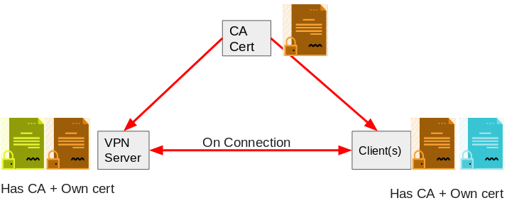
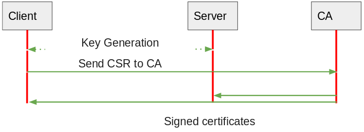

OpenVPN Cryptography
====================

- [OpenVPN Cryptography](#openvpn-cryptography)
- [Introduction](#introduction)
- [Motivation](#motivation)
  - [Information Security in Untrusted networks](#information-security-in-untrusted-networks)
  - [Securing access to restricted resources](#securing-access-to-restricted-resources)
- [Alternatives](#alternatives)
- [Trust](#trust)
  - [Public Key Infrastructure (PKI)](#public-key-infrastructure-pki)
  - [Certificate Authority (CA)](#certificate-authority-ca)
  - [Easy-RSA, PKI toolchain for OpenVPN](#easy-rsa-pki-toolchain-for-openvpn)
- [Encryption and authentication methods](#encryption-and-authentication-methods)
  - [Password-only authentication](#password-only-authentication)
  - [Symmetric encryption using static keys](#symmetric-encryption-using-static-keys)
  - [Hybrid encryption using public-Key cryptography via certificates](#hybrid-encryption-using-public-key-cryptography-via-certificates)
- [Security Controls in ISO 27k documents](#security-controls-in-iso-27k-documents)
  - [A10 Cryptography controls in 27K:](#a10-cryptography-controls-in-27k)
    - [10.1.1 Policy on the use of cryptographic controls](#1011-policy-on-the-use-of-cryptographic-controls)
    - [A.10.1.2: Key management](#a1012-key-management)
- [Conclusion](#conclusion)
  - [CIA Analysis](#cia-analysis)
- [Source](#source)

# Introduction

OpenVPN establishes a Virtual Private Network to secure communication over an untrusted supporting network. It implements a custom protocol on-top of the transport network layer to encrypt the traffic point-to-point, different from IPsec, and uses the cryptographic protocol **TLS** for key exchange to ensure the integrity and confidentiality of the communication via the **OpenSSL** encryption library. Members off the VPN authenticate each other using pre-shared cryptographic certificates or alternatively shared credentials (*username* and *password*). Latter case won’t be further considered in this document.
In a typical setup there’s one node functioning as the role of a VPN server providing access to a secure resource and enables nodes functioning as the role of clients, usually remote to the servers network via the WAN/Internet, to connect to and access the resource. Depending on the servers configuration the clients me or may not be able to see or communicate with each other. This server has its own server certificate which all clients need a copy of to authenticate the server and each client has its own client certificate which need to be kept secret.

# Motivation
## Information Security in Untrusted networks
In _public_ networks like open hotspots which provide free Internet to costumers the medium over which network traffic is send can't be trusted with **integrity** and **confidentiality** of your information.
Because
- Wireless networks are open to listening
- Network services can be hijacked
- Man-in-the-Middle attacks are easy

For this reason a virtual private network can be used to _upgrade_ your public network to a trusted network to send traffic in encrypted form over.

## Securing access to restricted resources

A Virtual Private Network is established to allow the client access to restricted resources through a private _VPN tunnel_, securing the information send from and to the resource no matter the carrier network.

# Alternatives
There exist several VPN alternatives, with most being closed-source or proprietary. For some use-cases *Remote Access* technologies like OpenSSH or Microsofts Remote Desktop Protocol (RDP) may suffice to access restricted resources like services or IT infrastructure.
In particular Web Services can be tunneled through HTTPS (HTTP through TLS), E-Mail and messaging systems through *STARTTLS* and *S/MIME*, and remote access through TLS using *RSA* and *DH* algorithms similar to OpenVPN.

VPN and in particular OpenVPN on the other hand offers a highly flexible tunneling solution.
Advantages which may only be partially covered by alternatives for VPN are:
- Transparent usage, any network traffic will be transported through the tunnel
- The client appears to be inside the **secured internal network (Intranet)**
- If setup correctly no traffic send out to the internet gets leaked, including DNS and even if VPN gets disconnected (*Kill Switch*)
- **Mutual authentication** with each peer having its own certificate
- Certificate and therefore access of a particular entity can be *revoked* without its involvement
- Scalable, distributable, Congestion-proof and high stability through fast reconnects
- **Perfect Forward Secrecy**

# Trust
The client needs to be able to trust the remote VPN server "is who he says he is" to establish a secure SSL/TLS connection.
In the case of typical HTTPS connections for web servers trust is established via a *chain of trust* starting with the manufactur installed root certificates over intermediate certificates until the web servers certificate with each corresponding entity giving trust to the one entity next in the chain.


See also [Chain of trust - Wikipedia](https://en.wikipedia.org/wiki/Chain_of_trust)

In the case of **OpenVPN** trust is established by one Certificate Authority (CA) which *gives* trust to all the legitimate peers in the VPN network by signing their certificate.
A signed certificate from a remote peer by the CA which is **locally trusted** proves the remote peer is trusted as well since the signature is only given by the CA after validing the certificate ownership.

## Public Key Infrastructure (PKI)
The CA is arguably the main part of a PKI. Without trust a secure connection can't be established and CA is the entoty in a PKI which *give* trust to another entity. After trust is verified an encrypted connection may be established taking advantage of *public-key cryptography* using **certificates** for each entity and corresponding **private keys** which never leaves the entities control i.e. only stored on the device it was generated on.
Each entities certificate is signed by the CA after validating the ownership of the certificate and since every peer trusts the CA they therefore trust the certificates signed by it.
This *framework* allows users t to create the unsigned certificate, corresponding private keys and signing requests (CSR), which is just a *self-signed* certificate.

**Certificate relationship:**
- All participants have and trust the CA's certificate
- VPN Server and Client(s) each have their own certificate signed by the CA
- Upon connection the peers certificate is exchanged and validated by the other party against the CA's certificate
  
****

## Certificate Authority (CA)
A Certified Authority is a body that issues certificates to entities after verifying their identity (correct ownership of the certificate). The CA then signs the certificate thereby authenticating the identity of the requestor. In Addition the CA *stamps* the certificate with an expiration date. The CA may return the certificate to the requesting system and/or post it in a repository.
The CA entity on uses the PKI tools to create its self-signed certificate for destribution and manages the members (clients and server) certificates life-cycle by signing and revoking them if needed using *Certificate Revokation Lists* (CRLs).

**Rough sequence diagram of entities and their ceractions for signingtificates:**
1. Key pair is generated by each party
2. CSR is created and send to CA and ownership is proven
3. CA sends signed certificates back

****

## Easy-RSA, PKI toolchain for OpenVPN
> A simple enrollment utility is Easy-RSA 2.0 which is part of OpenVPN 2.1 series

From [OpenVPN docs](https://openvpn.net/community-resources/how-to/#pkcs11_determine_provide)

Easy-RSA provides **tools and commands** to use and maintain a *Public Key Infrastructure* and is included in a typical OpenVPN installation.
This allows each entity to generate their own corresponding **Public and Private key** and a **Certificate Signing Request** which has to be send to the CA, ownership of the key pair validated, e.g. by using a secure channel, and finally signed by the CA and send back.
The CA on the other hand uses the Easy-RSA *toolchain* additionally, to typical key pair generation and self-signing, to sign the other entities certificates and manage their life-time.
Certificates may be invalidated either by **expiring** depending on the expiration date written into the certificate by the CA and by **revoking** the certificate using CRLs.

**Example commands for clients/server:**
```bash
# Required to initialize PKI locally:
$ easyrsa init-pki 
# Generate a keypair and certificate request in PKCS#10 format:
$ easyrsa gen-req nameOfRequest
```

**Example commands specific to CA:**
```bash
# Generate CA entity (selg-signed certificate for signing):
$ easyrsa build-ca
# Import CSR for review and signing
$ easyrsa import-req /path/to/request.req nameOfRequest
# Sign certificate with default options
#  like expiration date 10 years after signing
$ easyrsa sign-req client NAME
```

# Encryption and authentication methods
OpenVPN supports several encryption and authentication methods allowing the client to prove to the server _"he is who he says he is"_ to establish a **secure and trusted VPN tunnel**.
See also [OpenVPN's documents](https://openvpn.net/community-resources/how-to/#auth).

## Password-only authentication
The client authenticates using a user and password combination to send to the VPN Server over a secure TLS channel for authentication. The server is still required to provide a certificate upon connection to be able to establish a secure TLS connection.
The use of a CA certificate to establish trust of the remote and providing a client certificate to the certificate to prove identity is **optional** if using the *auth-user-pass* directive.
The username and password is passed to an authentication plugin to verify validity and either allow or block authentication.
**Security** using this method is comparable to an OpenSSH server with authentication via a username and password, verifying the remotes identity is optional but after the first connection its *fingerprint* is remembered and stored.

**Advantages/Disadvantages**
- 
| Advantages           | Disadvantages                                     |
| -------------------- | ------------------------------------------------- |
| + Easy setup & Usage | - Compromise of authentication method more likely |
|                      | - Loss of authentication method likely            |
|                      | - No VPN Server verification                      |

## Symmetric encryption using static keys
With OpenVPN version 1.X (first version) OpenVPN used to use point-to-point connection and static keys.
These keys have to be shared via a secure channel because if compromised all data send through the VPN tunnel could be decrypted by a 3rd party who gained access to the key, including past sessions which used the same key.
The VPN Server is setup specifically to allowed a known client.

| Advantages           | Disadvantages                                          |
| -------------------- | ------------------------------------------------------ |
| + Easy Usage         | - Requires secure channel to share key securely        |
|                      | - No perfect secrecy -> past sessions can be decrypted |
|                      | - No VPN Server or client verification                 |

## Hybrid encryption using public-Key cryptography via certificates
A **perfect forward security** is established by combining signed certificates to establish trust and variable session keys. The session key supporting symmetric traffic encryption is used for the life-time of a session, always unique to the session and never stored which makes it harder to compromise compared to static-key encryption. It is *negotiated* via the *DH* key exchangefrom from two generated keys, one from each party and send to the other party in encrypted form using its public key, and then *combined* into the symmetric key which is the same for both parties and far more efficient to encrypt and decrypt the packets.
This method combines public-key cryptography with symmetric encryption and is therefore called hybrid encryption with the advantages of both.
The VPN Server doesn't need to have or know of all the clients certificates which may connect to it.
If the current session key is compromised due to an attack only the current session can be decrypted, not past sessions which may have been recorded

| Advantages                           | Disadvantages                          |
| ------------------------------------ | -------------------------------------- |
| + Trust established                  | - More involved to setup and maintain  |
| + Perfect-Forward-Secrecy            | - Certificates expire                  |
| + Central access managenent using CA |                                        |

# Security Controls in ISO 27k documents
From ISO 27002 Appendix

A 9 Business requirements of access control
To limit access to information and information processing facilities

**13.2.1: Information transfer policies and procedures**
Objective: To maintain the security of information transferred within an organization and with any external entity      

**9.1.2 Access to networks and network services**

## A10 Cryptography controls in 27K:
Effectively use cryptographic tools

### 10.1.1 Policy on the use of cryptographic controls

### A.10.1.2: Key management
With:
- Generation of the keys **(Diffie-Hellman-KeyExchange)**
- Distribution of keys including the usage

# Conclusion
Results and CIA analysis

## CIA Analysis
With a weighting of 0-10
| VPN Encryption                    | Confidentiality | Integrity       | Availability    |
| --------------------------------- | --------------- | --------------- | --------------- |
| Using static keys <br>➜ symmetric |    7            |    7            |    9            |
| Using Certificates <br>➜ hybrid   |    9            |    9            |    9            |

# Source
https://www.lynda.com/SSL-tutorials/Trust-encryption-network/178124/196828-4.html
https://www.cisco.com/c/en/us/products/security/vpn-endpoint-security-clients/what-is-vpn.html
